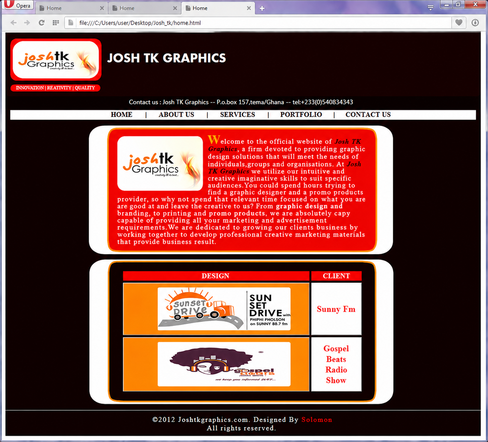

# 🌐 My First Webpage (2012)

This project represents my very first semester project in **HTML and CSS**, created in **2012** while I was a first-year student at **Valley View University** studying *Information Technology Foundation*.

It was my introduction to web development and marked the beginning of my journey as a developer.

---

## 📌 Project Background

In 2012, I designed a simple website for my friend’s graphic design brand called **Josh TK Graphics**. At that time, I had no knowledge of version control systems like GitHub, so the original source code was never preserved or hosted online.

Years later, I was able to recover screenshots of the project that I had previously uploaded to Facebook. Using those images and the help of ChatGPT, I reconstructed the original **HTML and CSS code** as closely as possible.

---

## 🖼️ Webpage Preview

Below is a snapshot of the original webpage design:

> *This image represents the original design created in 2012.*

---

## 🚀 Live Demo

You can view the reconstructed version of the project here:

🌐 https://www.solomonadeklo.com/MyFirstWebpage/

---

## 📂 Source Code

The recreated source code is available on GitHub:

🔗 https://github.com/solomonyaw/MyFirstWebpage

---

## 🎯 Purpose of This Project

I preserved and rebuilt this project to:

- Document my early journey in web development  
- Inspire upcoming developers and designers  
- Show how small beginnings can lead to growth  
- Demonstrate the evolution of my skills over time  

---

## 💡 Final Note

Every expert was once a beginner. This project reminds me that consistency and curiosity are the foundation of growth in tech.

---

## 👨‍💻 Author

**Solomon Adeklo**  
Information Technology Specialist | Developer | Designer
